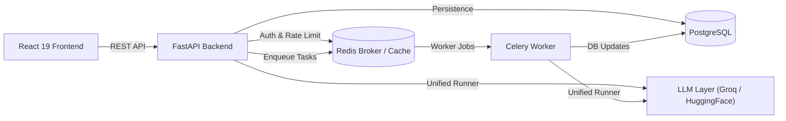

# LLMOps Platform

An operations and prompt lifecycle management platform designed to evaluate, test, and optimize Large Language Model prompts. The platform prevents prompt regressions, detects hallucinations, tracks compute latency and costs, and supports pairwise A/B testing with background task execution.

## Key Features

- **Prompt Versioning & Management:** Semantic prompt version tracking (`v1`, `v2`, ...), template variable rendering, active version assignment, and line-by-line unified diff comparisons.
- **Automated Regression Testing:** Evaluate prompt iterations against persistent Golden Examples using an LLM-as-a-judge scoring engine (task correctness, completeness, and hallucination rate).
- **Batch Experiments:** Automated matrix evaluation of all prompt versions against all golden test cases to track performance evolution.
- **Pairwise A/B Testing:** Side-by-side prompt execution running candidate versions in parallel with user preference voting and qualitative feedback.
- **Asynchronous Execution:** Background task processing powered by Celery and Redis to handle LLM generation and batch evaluations without blocking API workers.
- **Cost & Latency Tracking:** Continuous monitoring of request latency (ms), token consumption (input/output), and estimated compute costs per run.
- **Multi-Provider LLM Architecture:** Provider-agnostic execution supporting Groq and Hugging Face with lazy loading, pooled HTTP connections, and model catalog discovery.
- **Dual-Token Authentication & Rate Limiting:** JWT-authenticated user registration and API key management, paired with Redis-backed sliding-window rate limiting (60 req/min).

## Architecture

The platform follows a decoupled, 5-layer backend pattern (`Router → Controller → Service → Repository → Model`) connected to an asynchronous task queue and a React frontend.



## Tech Stack

| Layer | Technologies |
|---|---|
| **Backend** | Python 3.11, FastAPI, Pydantic v2, SQLAlchemy 2.0, Alembic |
| **Frontend** | React 19, Vite 7, Tailwind CSS v4, React Router v7, Recharts, Axios |
| **Database** | PostgreSQL 15 |
| **Task Queue & Cache** | Celery 5.3, Redis 7 (broker & result backend) |
| **AI / LLM Providers** | Groq SDK (`gpt-oss-20b`, `gpt-oss-120b`, `qwen3-27b`), Hugging Face Hub (`qwen-2.5-1.5b`), LangChain Core |
| **Infrastructure & CI/CD**| Docker (multi-stage), Docker Compose, GitHub Actions, AWS EC2 deploy script, Vercel proxy |

## Project Structure

```text
├── alembic/                # Database migrations (HEAD: f6c7b7868853)
├── app/
│   ├── api/                # FastAPI routes, controllers, and schemas
│   ├── core/               # Config, database, security, rate limiting, logging
│   ├── llm/                # Provider strategy, registry, and execution runner
│   ├── models/             # SQLAlchemy ORM models
│   ├── repositories/       # Data access layer
│   └── services/           # Business logic, evaluator, and Celery tasks
├── frontend/               # React 19 application (Dashboard, Playground, Prompts, etc.)
├── tests/                  # Backend unit, sanity, and migration tests
├── docker-compose.yml      # Service orchestration (API, Worker, Postgres, Redis)
└── Dockerfile              # Multi-stage Python 3.11 container image
```

## Getting Started

### Prerequisites
- Python 3.11+
- Node.js 18+
- Docker & Docker Compose (or local PostgreSQL 15 & Redis 7)

### 1. Run with Docker Compose (Recommended)

```bash
# Clone the repository
git clone https://github.com/mirofadlalla/LLM-Platform-LLMOps-System.git
cd LLM-Platform-LLMOps-System

# Create environment file from template
cp .env.example .env
# Configure your GROQ_API_KEY, HUGGINGFACE_API_KEY, and POSTGRES_PASSWORD in .env

# Build and start all services (PostgreSQL, Redis, Migrations, API, Celery Worker)
docker compose up -d --build
```
- **API:** http://localhost:8000
- **Interactive OpenAPI Docs:** http://localhost:8000/docs
- **Health Check:** http://localhost:8000/api/v1/health

### 2. Run Locally for Development

```bash
# Backend
python -m venv venv
source venv/bin/activate  # On Windows: .\venv\Scripts\Activate.ps1
pip install -r requirements.txt
alembic upgrade head
uvicorn app.main:app --reload --port 8000

# Celery Worker (separate terminal)
celery -A app.core.celery_app worker -l info -Q llm_tasks_queue,celery

# Frontend (separate terminal)
cd frontend
npm install
npm run dev
```

### 3. Generate Dev Credentials
```bash
python create_test_api_key.py
# Creates test user 'dev@example.com' with API key 'dev-key'
```

## API Overview

All routes are prefixed with `/api/v1`:

| Domain | Key Endpoints | Description |
|---|---|---|
| **Health** | `GET /health` | Healthcheck endpoint |
| **Auth** | `POST /auth/register`, `POST /auth/login`, `POST /auth/api-keys` | User accounts, JWT auth, and API key management |
| **Prompts** | `POST /prompts`, `GET /prompts`, `POST /prompts/{id}/versions`, `GET /prompts/diff` | Prompt CRUD, versioning, activation, and template diffing |
| **Evaluation** | `POST /prompts/{id}/golden-examples`, `POST /prompts/{id}/versions/{id}/evaluate` | Reference test cases and single-version LLM judge evaluation |
| **Runs** | `POST /run`, `GET /runs`, `GET /task-status/{id}` | Async prompt execution, execution history, and task status |
| **Experiments**| `POST /experiments/run`, `GET /experiments/{id}/status` | Multi-version batch regression testing against golden examples |
| **A/B Testing** | `POST /ab-tests`, `POST /ab-tests/{id}/vote`, `GET /ab-tests` | Parallel pairwise prompt generation, voting, and feedback |
| **Models** | `GET /models`, `GET /providers` | Registered model catalog and provider discovery |

## Documentation

For the complete technical documentation:

[📖 Read the full technical documentation](docs/PROJECT_DETAILS.md)
